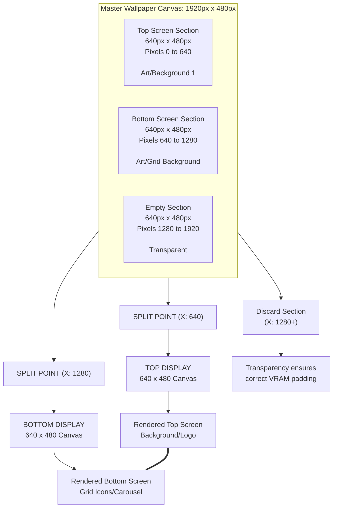

# Theme Customization Examples

Welcome to the customization examples directory! This folder contains curated, ready-to-use examples demonstrating how to personalize the theme layout, color schemes, and system assets.

Use these configurations as blueprints to build your own custom-tailored gaming environment.

## Available Examples

### 1. Pokémon Modifications

This example will show you how to apply custom wallpaper, colors and also how to replace the system icons using Custom-Art icons option.

* **Wallpaper:** Applied the pokemon wallpaper from the [**dii-ess-aye**](https://github.com/beebono/dii-ess-aye) theme. 
* **Colors:**: Applied custom colors to go with the wallpaper using purple and orange colors.
* **Custom Art Icons** : Applied custom art icons from [anthonycaccese](https://github.com/anthonycaccese) amazing [alekfull-nx](https://github.com/anthonycaccese/alekfull-nx-es-de) theme 
* **Path:** `./pokemon`

### 2. The Legend of Zelda Modifications
This is a much simpler example that just changes wallpaper and colors.

* **Wallpaper:** Applied the pokemon wallpaper from the [**dii-ess-aye**](https://github.com/beebono/dii-ess-aye) theme. 
* **Colors:**: Applied custom colors to go with the wallpaper using purple and orange colors.
* **Path:** `./zelda`

---

## How to Apply An Example

1. Navigate to the specific subfolder of the design you want to use (`pokemon` or `zelda`).
2. Copy the contents of the folder into `theme-customizations`.
3. If asked to replace files say yes.
4. Fully restart EmulationStation to clear the VRAM texture cache and see the changes take effect.

## How to customize your own theme

Make sure to check custom.webp file inside `wallpapers`. That file will help you to create new wallpaper images.

### System View Art

- Create the folder called `artwork` in the theme customization directory mentioned above.
- Create your custom artwork as a 1-1 aspect ratio square image.
- Export your final images as webp, pngs, or jpgs.
- They can be named:
  - ${system.theme}.webp
  - ${system.theme}.png
  - ${system.theme}.jpg
- The theme will look them them up in that order. If a given image is not found in your folder then the the images from the theme will be used as a fallback. This allows you to customize only the images you want and still have images displayed for all systems.
- ${system.theme}.webp should be named for the system you are looking to override. For example if you wanted to override the artwork for snes you would create an image called snes.webp in the artwork folder. Once your images are in place you turn on custom images by changing the `System Icon Style` setting to `Custom (Art)`.

### System View Icons

- Create the folder called `icons` in the theme customization directory chosen above.
- Create your custom icon following the other systems location and size.
- Export your final images as webp or pngs.
- They can be named:
  - ${system.theme}.webp
  - ${system.theme}.png
- The theme will look them them up in that order. If a given image is not found in your folder then the the images from the theme will be used as a fallback. This allows you to customize only the images you want and still have images displayed for all systems.
- ${system.theme}.webp should be named for the system you are looking to override. For example if you wanted to override the icons for snes you would create an image called snes.webp in the icons folder. Once your images are in place you turn on custom images by changing the `System Icon Style` setting to `Custom (Icons)`.

### Wallpapers and Color Schemes

- Locate the folder `wallpapers` within Emulation Stations' theme directory at: `canvas-ds/wallpapers`
- Inside are .webp images named after the color schemes.
- Save over any of these with your new wallpaper (or a new jpg image) to change that color scheme look.
- Alternate wallpapers are also stored in the "Alternate" folder as an example. **But this images have not been modified to look well on dual screen setup.**

- Alternatively, use the color scheme `Custom` to point to a .jpg or .webp file named `custom` within `theme-customizations\wallpapers`. The theme will default to `themes\canvas-ds\wallpapers\custom.webp` if no wallpaper is found.
- Choosing `Custom` also allows a new color scheme to be created within `theme-customizations\colors.xml`. If no file is present, it will default to the custom color scheme within `themes\canvas-ds\colors.xml` however this will be overriden if the theme is updated.

### Wallpaper Creation and Cutting Guide (Dual Screen)

To create a single, continuous wallpaper that flows correctly across the top and bottom screens of your device, you must create a wide **1920 x 480** canvas, structured as three (3) distinct **640x480** sections side-by-side.

Only the first two sections (Top and Bottom) contain artwork; the third section **MUST** be completely empty (transparent).

